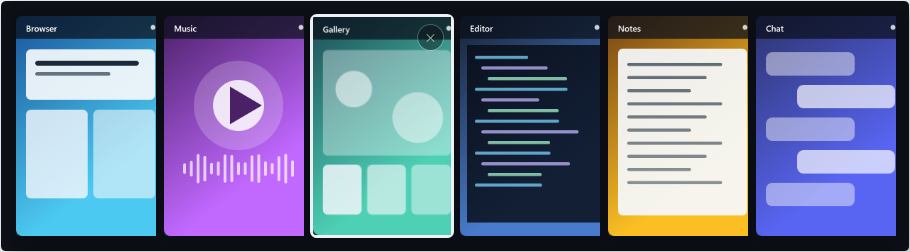
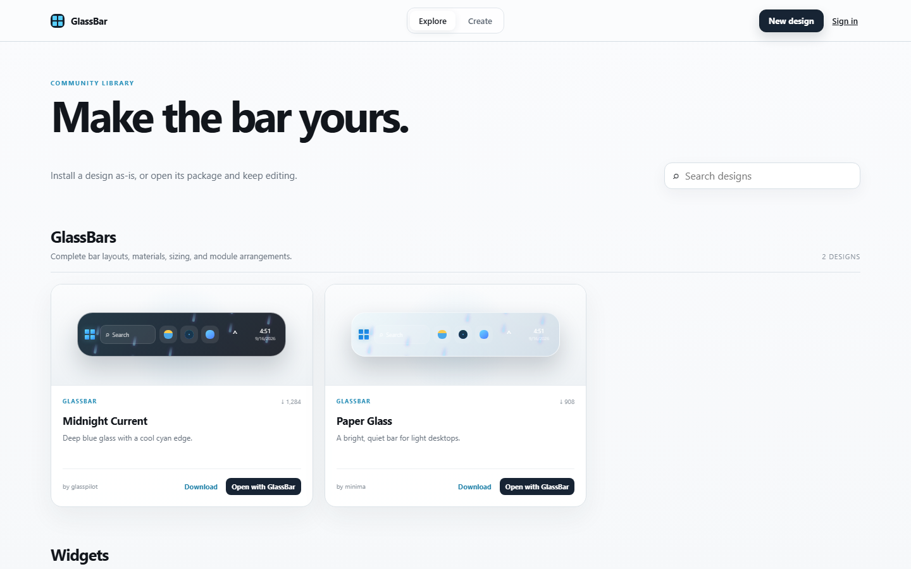

# GlassBar

A translucent, animated Windows taskbar overlay. GlassBar leaves Explorer running and only hides the native taskbar window while GlassBar is open. Closing GlassBar restores it immediately.

Its custom launcher keeps GlassBar's visual effects while searching installed apps, Windows settings, indexed files and folders, and the web, with native app icons and keyboard navigation.

[Website](https://get-glassbar.vercel.app) · [Download](https://github.com/Sing2236/GlassBar/releases/latest/download/GlassBarSetup.exe) · [Support](https://www.paypal.com/cgi-bin/webscr?cmd=_donations&business=Ethanhuynh365%40gmail.com&currency_code=USD)

## See it

The animation below is captured from the real app, moving from **Aurora** into **Rain**.

### Switch windows

### Add the widgets you want

### Make it yours

## Support

If GlassBar is useful to you, you can [support its development with PayPal](https://www.paypal.com/cgi-bin/webscr?cmd=_donations&business=Ethanhuynh365%40gmail.com&currency_code=USD).
