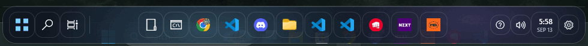

# GlassBar

A translucent, animated Windows taskbar overlay. GlassBar leaves Explorer running and only hides the native taskbar window while GlassBar is open. Closing GlassBar restores it immediately.

[Website](https://get-glassbar.vercel.app) · [Download](https://github.com/Sing2236/GlassBar/releases/latest/download/GlassBarSetup.exe) · [GlassBar Pro — $5 once](https://www.paypal.com/cgi-bin/webscr?cmd=_xclick&business=Ethanhuynh365%40gmail.com&item_name=GlassBar+Pro+Lifetime&amount=5.00&currency_code=USD&no_shipping=1) · [Support](https://www.paypal.com/cgi-bin/webscr?cmd=_donations&business=Ethanhuynh365%40gmail.com&currency_code=USD)

## Preview

The animation below is captured from the real app, moving from **Aurora** into **Rain**.

## Support

If GlassBar is useful to you, you can [support its development with PayPal](https://www.paypal.com/cgi-bin/webscr?cmd=_donations&business=Ethanhuynh365%40gmail.com&currency_code=USD).
