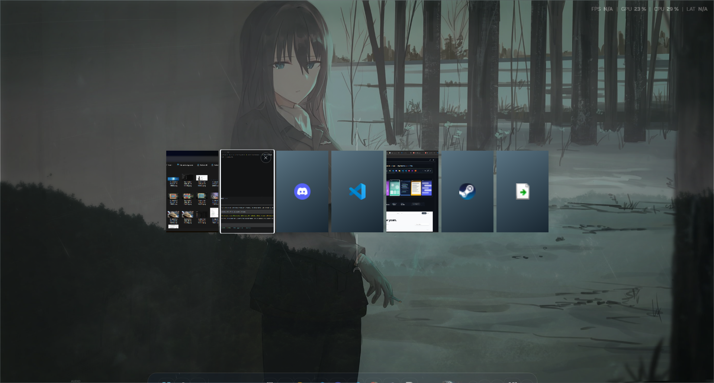
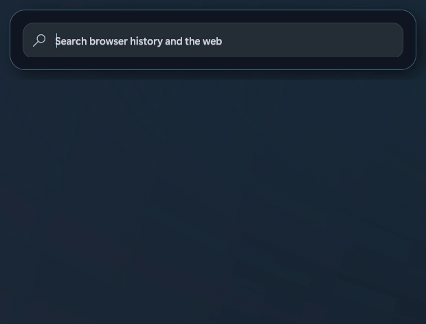
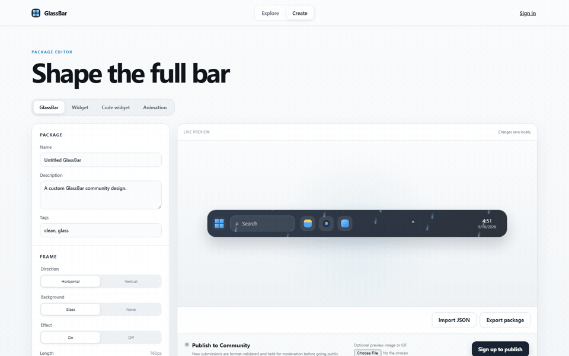

# GlassBar

A translucent, animated Windows taskbar overlay. GlassBar leaves Explorer running and only hides the native taskbar window while GlassBar is open. Closing GlassBar restores it immediately.

Its custom launcher keeps GlassBar's visual effects while searching installed apps, Windows settings, indexed files and folders, and the web, with native app icons and keyboard navigation.

[Website](https://get-glassbar.vercel.app) · [Download](https://github.com/Sing2236/GlassBar/releases/latest/download/GlassBarSetup.exe) · [Support](https://www.paypal.com/cgi-bin/webscr?cmd=_donations&business=Ethanhuynh365%40gmail.com&currency_code=USD)

## See it

The animation below is captured from the real app, moving from **Aurora** into **Rain**.

### Switch windows

Choose a compact strip or a full-screen switcher, then set the background and opacity to fit your desktop.

### Built-in Search Bar

### Add the widgets you want

### Make it yours

## Why GlassBar

- Make the taskbar feel personal with transparent materials, animated effects, layouts, colors, and an audio visualizer.
- Switch windows and search open apps or the web without leaving the GlassBar look.
- Add useful widgets, pin the apps you care about, and create new designs in Community Studio.
- Keep the Windows desktop underneath it all. Closing GlassBar restores the native taskbar immediately.

## Support

If GlassBar is useful to you, you can [support its development with PayPal](https://www.paypal.com/cgi-bin/webscr?cmd=_donations&business=Ethanhuynh365%40gmail.com&currency_code=USD).
