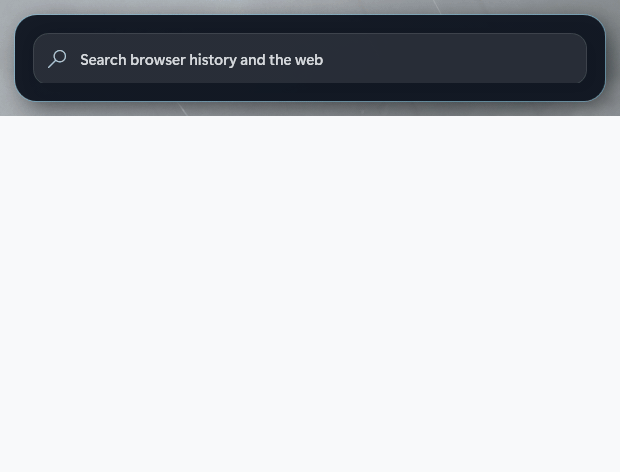

# GlassBar

A translucent, animated Windows taskbar overlay. GlassBar leaves Explorer running and only hides the native taskbar window while GlassBar is open. Closing GlassBar restores it immediately.

Its custom launcher keeps GlassBar's visual effects while searching installed apps, Windows settings, indexed files and folders, and the web, with native app icons and keyboard navigation.

[Website](https://get-glassbar.vercel.app) · [Download](https://github.com/Sing2236/GlassBar/releases/latest/download/GlassBarSetup.exe) · [Support](https://www.paypal.com/cgi-bin/webscr?cmd=_donations&business=Ethanhuynh365%40gmail.com&currency_code=USD)

## See it

The animation below is captured from the real app, moving from **Aurora** into **Rain**.

### Switch windows

Choose a compact strip or a full-screen switcher, then set the background and opacity to fit your desktop.

### Find an open app

### Add the widgets you want

### Make it yours

## Compare

| App | Best for | Built-in extras |
| --- | --- | --- |
| **GlassBar** | One animated home for the taskbar and window switching | Custom Alt+Tab, open-app and web search, widgets, audio visualizer, and Community Studio |
| [Aero Dock](https://github.com/TheAgencyMGE/aero-dock) | A glass dock with app and window management | Live previews, themes, app search, per-app audio, and ambient scenes |
| [TranslucentTB](https://github.com/TranslucentTB/TranslucentTB) | Restyling the native Windows taskbar | Transparency, color, and dynamic appearance rules |
| [RoundedTB](https://github.com/RoundedTB/RoundedTB) | Changing the native taskbar's shape | Margins, rounded corners, and dynamic or split modes |

GlassBar is for people who want the bar, switcher, search, widgets, and visual effects to feel like one system.

## Support

If GlassBar is useful to you, you can [support its development with PayPal](https://www.paypal.com/cgi-bin/webscr?cmd=_donations&business=Ethanhuynh365%40gmail.com&currency_code=USD).
